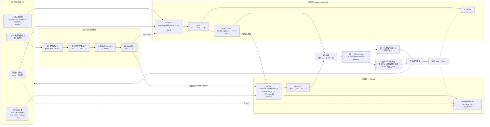
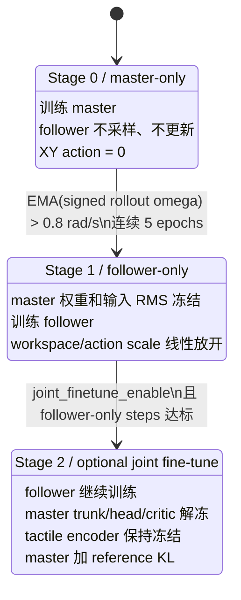

# `valvedriver_tactile_xy` 主从协同控制技术文档

> 整理日期：2026-08-24  
> 适用任务：`valvedriver_tactile_xy`  
> 训练算法：`HierarchicalPPO`  
> 训练配置：`valvedriver_tactile_frame813_xy.yaml`

## 1. 文档目的

本文档根据 [`REVO_HORA_SCREW_TASKS.md`](REVO_HORA_SCREW_TASKS.md) 和当前仓库实现代码，整理
`valvedriver_tactile_xy` 中灵巧手与机械臂末端的主从协同控制框架。内容可用于：

- 绘制算法总体框架图；
- 解释 master、follower、触觉编码器和环境控制器之间的数据流；
- 核对观测、动作和网络维度；
- 解释双 PPO、课程学习和底层物理执行器；
- 区分训练期特权信息与可部署观测；
- 明确当前实现与完整机械臂控制系统之间的边界。

---

## 2. 系统定位

### 2.1 核心结构

`valvedriver_tactile_xy` 使用一个 21 维灵巧手 master 和一个 2 维末端 XY follower：

```text
灵巧手 master：21-D hand action
末端 follower：  2-D [X, Y] action
环境联合动作：   23-D
```

两个策略基于同一个时刻的状态 `s_t` 决策：

1. master 首先输出手指动作和 128 维结构化触觉 latent；
2. follower 读取当前 master 动作、同次前向产生的触觉 latent 和 XY 滑台自身状态；
3. 两部分动作拼接为一个 23 维动作；
4. 每个控制周期只调用一次 `env.step()`。

这是一种**基于共享触觉表征的条件化双策略协同控制**。它与经典的时间尺度层级策略有所不同：

- master 不输出离散 option 或显式子目标；
- follower 不是以更高控制频率运行的伺服策略；
- master 和 follower 都在 20 Hz 控制频率下每周期决策一次；
- follower 直接以 master 本周期的执行动作作为条件，学习末端补偿。

因此更准确的算法名称是：

> 基于结构化触觉表征共享的灵巧手—末端条件化协同 Hierarchical PPO

### 2.2 “机械臂”在当前仿真中的含义

当前任务没有实例化完整的 UR5e 机械臂，也不包含机械臂关节空间控制、雅可比、逆运动学或
Cartesian impedance 模块。仿真中实际实现的是手腕前的二维物理平移滑台：

```text
world
  -> stage_x_joint，世界 X 轴 prismatic，硬限位 ±0.05 m
  -> stage_x_carriage，0.5 kg 刚体，无碰撞体，关闭重力
  -> stage_y_joint，世界 Y 轴 prismatic，硬限位 ±0.05 m
  -> right_hand_base_link
  -> Revo3 手掌和 21 个手指关节
```

所以在算法框架图中，建议把 follower 的物理对象标记为：

> 机械臂末端 XY 等效滑台 / End-effector XY follower

如果部署到完整机械臂，需要在 follower 输出之后增加：

```text
XY 位置增量
  -> Cartesian 目标或末端速度
  -> IK / Jacobian / Cartesian impedance
  -> 机械臂关节指令
```

该映射不属于当前仓库的 `valvedriver_tactile_xy` 实现。

---

## 3. 总体数据流

一个控制周期内的核心调用链为：

```python
master_result = master.act(obs_t, priv_info_t, tactile_hist_t)

executed_hand_action = clamp(master_result["actions"], -1, 1)
tactile_latent = master_result["tactile_latent"].detach()

follower_obs = concat(
    executed_hand_action,
    tactile_latent,
    xy_position_t,
    xy_velocity_t,
    xy_target_t,
    previous_xy_action_t,
    xy_workspace_margin_t,
)

follower_result = follower.act(follower_obs, critic_priv_t)
executed_xy_action = clamp(follower_result["actions"], -1, 1)

joint_action = concat(executed_hand_action, executed_xy_action)
obs_next, reward, done, info = env.step(joint_action)
```

重要时序约束：

- master 和 follower 都使用 `s_t`；
- 两次策略前向之间没有 `env.step()`；
- 两次前向之间没有 physics step、render 或传感器刷新；
- 触觉编码器每周期只运行一次；
- follower 使用的是 master 本次前向产生的 latent，不是下一时刻 latent；
- follower 的输入 latent 会被 `detach`，其损失不会反向传播到 master。

实现位置：

- [`hierarchical_ppo.py`](source/BrainCo_DexHand/BrainCo_DexHand/algo/hora/ppo/hierarchical_ppo.py)
- [`hierarchical_obs.py`](source/BrainCo_DexHand/BrainCo_DexHand/algo/hora/ppo/hierarchical_obs.py)

---

## 4. 张量和接口维度

### 4.1 总体维度表

| 数据或模块 | 维度 | 说明 |
|---|---:|---|
| master 公开观测 `obs` | 141 | 3 帧 × 47 |
| 单帧公开观测 | 47 | 21 手指角度 + 21 手指目标 + 5 指尖接触 |
| 完整 `priv_info` | 1181 | 11 基础特权 + 1170 当前 teacher 触觉帧 |
| master 实际读取的基础特权 | 11 | `priv_info[:, :11]` |
| teacher 触觉历史 | `10 × 1170` | 五指、115 个物理触觉节点 |
| 结构化触觉 latent | 128 | GRU 最终 hidden state |
| master Actor 输入 | 280 | 141 + 11 + 128 |
| master 动作 | 21 | Revo3 手指动作 |
| follower 观测 | 159 | 21 + 128 + 5×2 |
| follower actor 输出 | 2 | 世界 X/Y 平移动作 |
| follower critic 输入 | 170 | 159 follower obs + 11 base privilege |
| 环境联合动作 | 23 | 21 hand + 2 XY |

### 4.2 master 的 141 维公开观测

公开观测为最近三帧的滑动历史。每帧布局为：

```text
[0:21]   21 个手指关节角
[21:42]  21 个手指累计位置目标
[42:47]  5 个 DIP 指尖接触量
```

关节角在加入噪声后按关节上下限映射；指尖接触经过平滑、随机延迟和可选噪声。XY 滑台位置
和速度明确不进入该 141 维观测，因此 master 与原 21 维手内 teacher 保持相同的公开观测接口。

实现位置：

- [`revo3_hand_screw_env.py::compute_observations`](source/BrainCo_DexHand/BrainCo_DexHand/tasks/direct/hora_screw/revo3_hand_screw_env.py)

### 4.3 11 维基础特权信息

基础 `priv_info` 主要包含：

```text
[0:3]   阀门参考位置相对默认参考位置的偏移
[3]     接触摩擦参数
[4]     物体质量
[5:8]   物体质心参数
[8]     sin(阀门转角)
[9]     cos(阀门转角)
[10]    阀门角速度，裁剪并归一化
```

完整 `priv_info` 后面还附加 1170 维当前 teacher 触觉帧，但结构化 master 不会从
`priv_info` 尾部读取详细触觉，而是从独立的 `tactile_hist` 读取十帧历史。

这 11 维属于训练期 simulator privilege，框架图应使用虚线或特殊颜色标记。

---

## 5. 结构化触觉表示

### 5.1 物理节点布局

`valvedriver_tactile_xy` 使用 `estimated_official` 五指物理节点布局：

```text
thumb:  31 nodes
index:  21 nodes
middle: 21 nodes
ring:   21 nodes
little: 21 nodes
total: 115 nodes
```

每个 teacher 触觉帧的维度为：

```text
115 nodes × 10 node channels + 5 fingers × 4 context channels
= 1150 + 20
= 1170
```

### 5.2 节点原始通道

每个物理节点的 10 个 teacher 通道为：

```text
[b, on, off, duration, eta,
 Fn, Ft1, Ft2, delta_Fn, delta_|Ft|]
```

含义概括如下：

- `b`：带迟滞的接触状态；
- `on/off`：本周期接触建立或释放事件；
- `duration`：连续接触时长的归一化表示；
- `eta`：节点相对接触中心沿接触滑移方向的结构量；
- `Fn`：法向力；
- `Ft1/Ft2`：两个切向力分量；
- `delta_Fn`：法向力变化；
- `delta_|Ft|`：切向力模长变化。

### 5.3 Frame813 编码输入

结构化编码器选择原始节点通道索引 `[0, 3, 5, 6, 7]`：

```text
[b, duration, Fn, Ft1, Ft2]
```

然后加入固定物理坐标 `[u,v]`，形成每节点七维输入：

```text
[u, v, b, d, Fn, Ft1, Ft2]
```

`u/v` 坐标来自 `estimated_official` 布局。每根手指分别执行：

1. 坐标减去该手指节点坐标均值；
2. 除以该手指最大节点间距；
3. 注册为模型 buffer；
4. forward 时不读取 JSON，也不重新计算距离。

帧末尾的五指 `5 × 4 = 20` 维 context 不进入当前 Frame813 encoder。

### 5.4 触觉编码网络

```text
[B, 10, 1170]
  -> 去掉末尾 20 维 finger context
  -> [B, 10, 115, 10]
  -> 选择 b/d/Fn/Ft1/Ft2，并加入 u/v
  -> [B, 10, 115, 7]
  -> 按手指切分并整体展平
  -> 每指独立 MLP
  -> [B, 10, 5, 32]
  -> 加 finger identity embedding
  -> 同帧五指 Self-Attention
  -> [B, 10, 5, 32]
  -> 每帧展平为 160
  -> 单层单向 GRU
  -> [B, 128]
```

每指 MLP：

```text
thumb:  31 × 7 = 217 -> 64 -> 32
index:  21 × 7 = 147 -> 64 -> 32
middle: 21 × 7 = 147 -> 64 -> 32
ring:   21 × 7 = 147 -> 64 -> 32
little: 21 × 7 = 147 -> 64 -> 32
```

这些 MLP 互不共享参数。该编码器不采用逐节点共享网络，也不做节点 pooling。

Self-Attention 参数：

```text
token dim: 32
heads: 4
feed-forward dim: 64
dropout: 0
```

GRU 参数：

```text
input dim: 5 × 32 = 160
hidden dim: 128
layers: 1
bidirectional: false
history length: 10
```

最终使用 `h_n[-1]` 作为 128 维触觉 latent `z_t`。

实现位置：

- [`models.py::FingerAttentionGRUTactileEncoder`](source/BrainCo_DexHand/BrainCo_DexHand/algo/hora/models/models.py)
- [`tactile_layout.py`](source/BrainCo_DexHand/BrainCo_DexHand/tasks/tactile_layout.py)
- [`revo3_hand_screw_tactile_env.py`](source/BrainCo_DexHand/BrainCo_DexHand/tasks/direct/hora_screw/revo3_hand_screw_tactile_env.py)

---

## 6. 灵巧手 master 策略

### 6.1 ActorCritic 输入

结构化 master 的输入为：

```text
normalize(public obs 141)
  + raw base privilege 11
  + tactile latent 128
= 280 dimensions
```

基础特权切片不经过 `env_mlp`、Linear、tanh 或 LayerNorm，而是直接与公开观测、触觉
latent 拼接。

### 6.2 网络结构

```text
280-D input
  -> MLP 512
  -> MLP 256
  -> MLP 128
       |-> hand action mean mu_H: 21
       |-> learnable log sigma_H: 21
       `-> master value V_H: 1
```

训练时策略为对角高斯：

```math
\tilde a_t^H \sim \mathcal N(\mu_H, \operatorname{diag}(\sigma_H^2))
```

真正送往环境的手指动作是：

```math
a_t^H = \operatorname{clip}(\tilde a_t^H, -1, 1)
```

master 在一次 forward 中同时返回：

- 21 维采样动作；
- 动作均值和标准差；
- value；
- 128 维触觉 latent。

实现位置：

- [`models.py::ActorCritic`](source/BrainCo_DexHand/BrainCo_DexHand/algo/hora/models/models.py)

### 6.3 master 的部署属性

当前 master 是 Stage-1 teacher，读取：

- 训练期基础特权状态；
- 包含力大小的 teacher 触觉历史；
- 公开手部观测。

因此当前 HierarchicalPPO master 不是完整的实机部署策略。仓库虽然存在 TactileDAgger
学生路线，但该学生没有被接入当前 `HierarchicalPPO` 主从 trainer。若要部署整个主从系统，
需要进一步将 master 蒸馏为只依赖实机可观测信号的学生，并处理 follower 对 master latent
的依赖。

---

## 7. 末端 XY follower 策略

### 7.1 follower 观测定义

follower actor 使用严格的 159 维观测：

| Slice | 名称 | 维度 | 来源 |
|---|---|---:|---|
| `[0:21]` | `executed_hand_action` | 21 | master 本周期裁剪后动作 |
| `[21:149]` | `tactile_latent` | 128 | master 同次 forward 的 GRU hidden，已 detach |
| `[149:151]` | `xy_position` | 2 | XY 实际关节位置 |
| `[151:153]` | `xy_velocity` | 2 | XY 实际关节速度 |
| `[153:155]` | `xy_target` | 2 | 当前累计位置目标 |
| `[155:157]` | `previous_xy_action` | 2 | 上一控制周期执行动作 |
| `[157:159]` | `xy_workspace_margin` | 2 | 到当前软件 workspace 边界的归一化距离 |

follower actor 明确不接收：

- master 的完整 141 维公开观测；
- 21 维手指关节角；
- 21 维手指位置目标；
- master actor 的 128 维 trunk feature；
- 完整 `priv_info`；
- 1170 维原始 teacher 触觉帧；
- 5 × 32 的 attended finger tokens。

这种接口让 master 的执行动作和结构化触觉 latent 成为两个策略之间的显式通信变量。

### 7.2 XY 状态归一化

位置和目标按固定物理硬限位归一化：

```math
\bar q_{xy} = \operatorname{clip}(q_{xy}/0.05,-1,1)
```

速度按命令速度上限归一化并裁剪：

```math
\bar v_{xy} = \operatorname{clip}(v_{xy}/0.15,-2,2)
```

workspace margin 使用当前课程 workspace `W`：

```math
m_i = \operatorname{clip}\left(1-\frac{|q_i|}{W},0,1\right)
```

它在 workspace 中心为 1，在边界或边界外为 0。

### 7.3 follower actor

```text
159-D follower obs
  -> MLP 256
  -> MLP 128
  -> MLP 64
  -> action mean mu_XY: 2
  + learnable log sigma_XY: 2
```

初始 `log sigma = -1.0`。训练期从对角高斯采样，执行前裁剪至 `[-1,1]`。

### 7.4 中心化 follower critic

follower critic 允许额外读取 `priv_info` 的前 11 维：

```text
159-D follower obs + 11-D base privilege
  -> 170-D
  -> MLP 256
  -> MLP 128
  -> MLP 64
  -> V_follower: 1
```

11 维 privilege 只进入 critic，不进入 actor。因此该部分属于 centralized training，而非
follower 执行期观测。

实现位置：

- [`models.py::FollowerActorCritic`](source/BrainCo_DexHand/BrainCo_DexHand/algo/hora/models/models.py)
- [`hierarchical_obs.py`](source/BrainCo_DexHand/BrainCo_DexHand/algo/hora/ppo/hierarchical_obs.py)

---

## 8. 联合动作与环境交互

### 8.1 动作布局

```text
action[:, 0:21]  -> 21 个灵巧手关节
action[:, 21:23] -> 世界 X/Y 平移滑台
```

联合动作：

```math
a_t = [a_t^H, a_t^{XY}] \in \mathbb R^{23}
```

### 8.2 单次环境交互原则

master 和 follower 的结果在策略端拼接，然后只执行一次：

```python
obs_next, reward, done, info = env.step(
    torch.cat([executed_hand_action, executed_xy_action], dim=-1)
)
```

这保证：

- 两个策略对应同一个 MDP transition；
- 两个动作同时影响本周期物理状态；
- rollout 中每个 `s_t` 只对应一组联合动作；
- master 与 follower 可以共享团队奖励和 done；
- 不会在两个策略决策之间引入隐含的环境状态变化。

---

## 9. 双 PPO 训练

### 9.1 共享与独立部分

master 和 follower 共享：

- 同一个环境 transition；
- 同一个 team reward；
- 同一个 `done` 和 timeout；
- 同一个 rollout 时间轴。

两者独立维护：

- ActorCritic 网络；
- value function；
- input `RunningMeanStd`；
- value normalizer；
- optimizer；
- learning rate；
- PPO ratio；
- GAE advantage；
- entropy 系数；
- KL scheduler；
- minibatch 大小。

### 9.2 双 GAE

同一个团队奖励分别通过两个 value function 计算 GAE：

```math
A_t^H = \operatorname{GAE}(r_t,V_H)
```

```math
A_t^{XY} = \operatorname{GAE}(r_t,V_{XY})
```

timeout bootstrap 也分别使用各自的 value，防止一个策略的价值估计进入另一个策略的
advantage。

默认公共参数：

```text
gamma: 0.99
GAE lambda: 0.95
PPO clip epsilon: 0.2
rollout horizon: 8
normalize advantage: true
```

### 9.3 独立 PPO ratio

master PPO ratio：

```math
\rho_H = \exp(\log\pi_H(a_t^H|s_t)-\log\pi_H^{old}(a_t^H|s_t))
```

follower PPO ratio：

```math
\rho_{XY} = \exp(\log\pi_{XY}(a_t^{XY}|o_t^{XY})-
                         \log\pi_{XY}^{old}(a_t^{XY}|o_t^{XY}))
```

两个策略分别执行 clipped PPO actor loss、clipped critic loss、entropy 和 action bounds loss。

### 9.4 默认更新参数

| 配置 | master | follower |
|---|---:|---:|
| 主学习率 | `1e-3` | `3e-4` |
| KL threshold | `0.01` | `0.016` |
| mini epochs | 5 | 5 |
| minibatch | 4096 | 8192 |
| critic coefficient | 4.0 | 2.0 |
| entropy coefficient | 0.0 | 0.005 |
| grad norm | 1.0 | 1.0 |

`scripts/hora/train.py --num_envs` 会在运行时覆盖 YAML 的 `ppo.num_actors`。例如
`--num_envs 4096`、horizon 8 时，一次 rollout batch 为 32768。

### 9.5 梯度隔离

follower observation 中的 hand action 和 tactile latent 都是 rollout 中存储的 detached
张量：

```text
follower loss
  -X-> master hand action head
  -X-> master tactile encoder
  -X-> master actor trunk
```

因此 follower PPO 不会通过条件输入反向修改 master。只有课程 Stage 2 中显式执行的 master
optimizer step 才会更新 master。

实现位置：

- [`hierarchical_experience.py`](source/BrainCo_DexHand/BrainCo_DexHand/algo/hora/ppo/hierarchical_experience.py)
- [`hierarchical_ppo.py::update_master`](source/BrainCo_DexHand/BrainCo_DexHand/algo/hora/ppo/hierarchical_ppo.py)
- [`hierarchical_ppo.py::update_follower`](source/BrainCo_DexHand/BrainCo_DexHand/algo/hora/ppo/hierarchical_ppo.py)

---

## 10. 三阶段课程学习

### 10.1 Stage 0：训练 master

```text
stage0_master
```

行为：

- master 正常采样并执行 21 维手指动作；
- master 执行 PPO 更新；
- follower 不采样、不更新；
- XY 动作严格为 `[0,0]`；
- workspace/action scale 保持 initial 值但不产生 follower 指令。

纯 XY 任务没有 yaw 任务所使用的机械锁死 mixin，因此零 XY 动作表示控制目标保持在零附近，
有限力 PD 下仍可能存在小量物理柔顺漂移。

### 10.2 Stage 0 到 Stage 1 的激活条件

每个 rollout 计算有符号平均阀门角速度，再更新 EMA：

```math
\bar\omega_{EMA}\leftarrow
\beta\bar\omega_{EMA}+(1-\beta)\bar\omega_{rollout}
```

默认：

```text
beta: 0.9
activation threshold: 0.8 rad/s
activation patience: 5 epochs
```

必须满足：

```text
EMA strictly > 0.8 rad/s
```

并连续保持 5 个 epoch。若某个 epoch 不满足，patience counter 清零。

激活是永久锁存的：Stage 1 激活后，即使速度下降也不会返回 Stage 0。0.8 rad/s 只用于课程
触发，不是奖励门控。

### 10.3 Stage 1：训练 follower

```text
stage1_follower
```

行为：

- master 参数全部冻结；
- master 输入归一化器也冻结；
- master 保持 eval 模式，输出手动作和触觉 latent；
- follower 开始采样和 PPO 更新；
- master 不执行 optimizer step；
- workspace 和 action scale 从激活时刻开始线性放开。

课程进度：

```math
p=\operatorname{clip}\left(
\frac{N_{agent}-N_{activation}}{N_{ramp}},0,1
\right)
```

默认 `N_ramp = 20,000,000 agent steps`。

| progress | XY workspace | XY action scale |
|---:|---:|---:|
| 0.0 | 0.01 m | 0.002 m/action |
| 0.5 | 0.03 m | 0.0035 m/action |
| 1.0 | 0.05 m | 0.005 m/action |

### 10.4 Stage 2：可选联合微调

```text
stage2_joint_finetune
```

进入条件：

```text
joint_finetune_enable == true
and
agent_steps - stage1_start >= follower_only_steps
```

行为：

- follower 继续 PPO 更新；
- master actor trunk、action head 和 critic 解冻；
- master 触觉编码器默认继续冻结；
- master 输入 normalizer 保持冻结；
- master 学习率跟随 follower 学习率；
- 对 Stage-1 起始 master 加 KL 正则。

master 学习率：

```math
lr_H = 0.07 \times lr_{follower}
```

Stage-2 master loss额外包含：

```math
L_{KL} = \lambda_{KL}
D_{KL}(\pi_H^{new}\;||\;\pi_H^{stage1\_start})
```

`stage1_start` reference 在 follower 激活时复制并永久冻结，使联合微调不会过度破坏 follower
开始训练时所依赖的 master 行为。

### 10.5 当前工作区配置差异

需要注意当前仓库存在如下配置差异：

- `REVO_HORA_SCREW_TASKS.md` 将 XY 基线描述为 `joint_finetune_enable: false`；
- `tests/test_hora_hierarchical_xy.py` 同样期望正式 XY YAML 为 `false`；
- 当前工作区的
  [`valvedriver_tactile_frame813_xy.yaml`](source/BrainCo_DexHand/BrainCo_DexHand/tasks/direct/hora_screw/agents/valvedriver_tactile_frame813_xy.yaml)
  实际值为 `true`；
- 当前值下会在 follower 激活后 50,000,000 agent steps 进入 Stage 2。

框架图建议把 Stage 2 画为虚线可选分支，并标注：

```text
文档定义的 XY follower-only 基线：关闭 Stage 2
当前工作区配置：开启 Stage 2，follower_only_steps = 50M
```

---

## 11. 底层物理控制

### 11.1 控制频率

```text
physics frequency: 240 Hz
decimation: 12
policy/control frequency: 20 Hz
control dt: 0.05 s
episode length: 40 s = 800 control steps
```

### 11.2 手指增量位置控制

手指动作被解释为位置目标增量：

```math
q_{target,t}=\operatorname{clip}\left(
q_{target,t-1}+\frac{1}{24}a_t^H,
q_{lower},q_{upper}
\right)
```

底层显式 PD：

```math
\tau_H=k_p(q_{target}-q)-k_d\dot q
```

默认：

```text
finger kp: 3.0
finger kd: 0.01
```

每个环境在 reset 时采样动作延迟。一个控制周期的前若干 physics substep 使用上一周期目标，
后续 substep 使用当前目标。

### 11.3 XY 累计位置目标

首先裁剪和指数平滑 follower 动作：

```math
a_s=(1-\alpha)\operatorname{clip}(a,-1,1)+\alpha a_{s,prev}
```

默认 `alpha = 0.5`。

将动作映射为位置增量：

```math
\Delta q_{raw}=s_{XY}a_s
```

加速度约束：

```math
\Delta q=\operatorname{clip}\left(
\Delta q_{raw},
\Delta q_{prev}-a_{max}dt^2,
\Delta q_{prev}+a_{max}dt^2
\right)
```

速度约束：

```math
\Delta q=\operatorname{clip}(\Delta q,-v_{max}dt,v_{max}dt)
```

累计并限制在当前软件 workspace：

```math
q_{target}=\operatorname{clip}(q_{target,prev}+\Delta q,-W,W)
```

默认：

```text
velocity limit: 0.15 m/s
acceleration limit: 8.0 m/s^2
workspace: 0.01 -> 0.05 m
action scale: 0.002 -> 0.005 m/control-step
```

### 11.4 XY 有限力 PD

物理滑台通过显式有限力 PD 驱动：

```math
F_{XY}=\operatorname{clip}\left(
k_p(q_{target}-q)-k_d\dot q,
-F_{max},F_{max}
\right)
```

默认：

```text
xy kp: 8000 N/m
xy kd: 200 N*s/m
effort limit: 120 N
sim joint velocity hard guard: 1.0 m/s
```

120 N 限制同时存在于显式控制器和 actuator `effort_limit_sim` 中。滑台不是无穷刚度的位置源，
也不是 kinematic teleport。

### 11.5 动作延迟

XY 控制器默认复用手指控制器的 per-environment action-delay 样本，使手和末端命令具有一致的
随机控制延迟。延迟只决定本周期的 physics substep 使用上一目标还是当前目标，不改变策略
控制频率。

实现位置：

- [`xy_stage.py`](source/BrainCo_DexHand/BrainCo_DexHand/tasks/direct/hora_screw/xy_stage.py)
- [`revo3_hand_screw_tactile_xy_env.py`](source/BrainCo_DexHand/BrainCo_DexHand/tasks/direct/hora_screw/revo3_hand_screw_tactile_xy_env.py)
- [`revo3_hand_screw_tactile_xy_env_cfg.py`](source/BrainCo_DexHand/BrainCo_DexHand/tasks/direct/hora_screw/revo3_hand_screw_tactile_xy_env_cfg.py)

---

## 12. 共享团队奖励

### 12.1 基础阀门任务奖励

主要包含：

```text
正向阀门角速度奖励
+ 五指接近阀门抓取中心奖励
- 超过课程阈值后的角速度惩罚
- 手指 torque 代价
- 手指机械 work 代价
+ capacity-aware 多指触觉协作奖励
```

阀门任务的主要系数：

```text
rotate reward scale: 6.0
pose-diff scale: 0.0
finger torque scale: -0.1
finger work scale: -0.01
overspeed penalty scale: -0.3
proximity reward scale: 2.0
```

旋转基础奖励使用裁剪后的阀门角速度，默认裁剪范围为 `[-4,4] rad/s`。

### 12.2 触觉多指协作奖励

触觉环境默认开启 capacity-aware endogenous coordination reward。其目标不是强制所有手指
同时持续接触，而是鼓励：

- 对阀门旋转方向有用的正向轴向力矩；
- 与各手指当前力臂容量相匹配的负载；
- 舒适、有效的多指负载分配；
- 具有时间连续性的稳定接触与顺序换指；
- 低滑移、低无效力和低过载。

该奖励与基础任务奖励相加后形成一个统一团队奖励。

### 12.3 XY 物理代价

末端滑台不是免费能源。环境额外扣除：

| 代价 | 默认权重 |
|---|---:|
| 速度平方 | `-0.05` |
| 加速度平方 | `-0.02` |
| jerk 平方 | `-0.01` |
| effort 平方 | `-0.05` |
| 机械功率 | `-0.02` |
| workspace 边界饱和 | `-0.05` |

各项先按对应物理上限归一化，再乘权重。手指 torque/work 只统计 21 个手指关节；XY effort
通过独立的 stage cost 统计，不会与手指代价重复计算。

### 12.4 高速奖励开关

`high_speed_reward_enable` 默认关闭。关闭时适合与不带 XY 的
`valvedriver_tactile` 做公平对比。

0.8 rad/s 的 follower 激活阈值从不进入奖励函数，因此课程切换点不会制造 reward jump。

---

## 13. Checkpoint 与恢复

### 13.1 master 热启动

```text
--master_checkpoint stage1_nn/best.pth
```

只加载：

- 21 维 master 权重；
- master 输入归一化统计；
- master value 归一化统计。

它不是完整 resume：

- follower 重新初始化；
- optimizer 重新初始化；
- 课程从 Stage 0 开始；
- agent step 和激活计数器清零。

### 13.2 完整层级恢复

```text
--checkpoint hier_nn/last.pth
```

恢复：

- master 和 follower 权重；
- 两个 optimizer；
- 两套 normalizer；
- agent steps；
- 当前 stage；
- 激活 EMA 和 patience counter；
- 课程激活时刻；
- workspace/action-scale ramp 进度；
- Stage-2 reference master（需要时）。

层级 checkpoint marker：

```text
hora_hierarchical_ppo_v1
```

### 13.3 严格维度校验

XY checkpoint 契约为：

```text
master_action_dim: 21
follower_action_dim: 2
follower_obs_dim: 159
env_action_dim: 23
stage_dof_names: [stage_x_joint, stage_y_joint]
```

加载到 1-D yaw 或 3-D XY+yaw 任务时会明确报维度错误。当前代码没有跨 follower 宽度的
权重迁移，也不会使用 `strict=False` 静默半加载。

---

## 14. 关键日志与实验指标

### 14.1 课程状态

```text
curriculum/hierarchical_stage
curriculum/activation_speed_ema
curriculum/activation_patience_counter
curriculum/xy_workspace
curriculum/xy_action_scale
hierarchical/master_frozen
hierarchical/joint_finetune_enabled
```

### 14.2 阀门性能

```text
screw/angular_velocity
screw/angular_velocity_positive_mean
screw/fraction_above_0_8
screw/fraction_above_1
screw/fraction_above_2
screw/fraction_above_4
screw/angular_position
```

### 14.3 XY 使用情况

```text
xy/position_x
xy/position_y
xy/velocity_norm
xy/acceleration_norm
xy/effort_norm
xy/power
xy/action_saturation_ratio
xy/boundary_saturation_ratio
xy/workspace_utilization
```

### 14.4 PPO 训练状态

```text
losses/master_actor
losses/master_critic
losses/follower_actor
losses/follower_critic
info/master_kl
info/follower_kl
info/master_lr
info/follower_lr
```

推荐主实验指标使用阀门角速度和速度分布，而不是只比较 episode reward：

```text
activation_speed_ema
angular_velocity
fraction_above_{0.8,1,2,4}
```

---

## 15. 算法框架图

### 15.1 总体框架



### 15.2 课程状态机



### 15.3 绘图视觉建议

建议使用四个水平区域：

```text
观测与传感器
  -> 结构化触觉编码和 master
  -> 条件化 follower
  -> 联合物理控制与环境反馈
```

线型建议：

- 实线：执行期真实数据流；
- 虚线：训练期 privilege、critic、reward 和 PPO 更新；
- 粗线：最终物理动作链路；
- 红色或锁形图标：`detach` 和冻结边界；
- 独立侧栏：三阶段课程状态机。

框架图中最需要强调的三个技术点：

1. 触觉编码器每控制周期只运行一次；
2. 128 维触觉 latent 同时服务 master 和 follower；
3. 两个策略基于同一个 `s_t` 决策并合成一次联合环境动作。

---

## 16. 关键实现文件索引

| 内容 | 文件 |
|---|---|
| 任务总览和训练方式 | [`REVO_HORA_SCREW_TASKS.md`](REVO_HORA_SCREW_TASKS.md) |
| HierarchicalPPO 主循环 | [`hierarchical_ppo.py`](source/BrainCo_DexHand/BrainCo_DexHand/algo/hora/ppo/hierarchical_ppo.py) |
| 双策略 rollout 和双 GAE | [`hierarchical_experience.py`](source/BrainCo_DexHand/BrainCo_DexHand/algo/hora/ppo/hierarchical_experience.py) |
| follower 观测契约 | [`hierarchical_obs.py`](source/BrainCo_DexHand/BrainCo_DexHand/algo/hora/ppo/hierarchical_obs.py) |
| Frame813 encoder、master、follower 网络 | [`models.py`](source/BrainCo_DexHand/BrainCo_DexHand/algo/hora/models/models.py) |
| 141 维手部观测和基础奖励 | [`revo3_hand_screw_env.py`](source/BrainCo_DexHand/BrainCo_DexHand/tasks/direct/hora_screw/revo3_hand_screw_env.py) |
| 触觉帧、触觉历史和协作奖励 | [`revo3_hand_screw_tactile_env.py`](source/BrainCo_DexHand/BrainCo_DexHand/tasks/direct/hora_screw/revo3_hand_screw_tactile_env.py) |
| XY 物理关节和控制流程 | [`revo3_hand_screw_tactile_xy_env.py`](source/BrainCo_DexHand/BrainCo_DexHand/tasks/direct/hora_screw/revo3_hand_screw_tactile_xy_env.py) |
| XY 物理与控制参数 | [`revo3_hand_screw_tactile_xy_env_cfg.py`](source/BrainCo_DexHand/BrainCo_DexHand/tasks/direct/hora_screw/revo3_hand_screw_tactile_xy_env_cfg.py) |
| XY 控制器纯函数 | [`xy_stage.py`](source/BrainCo_DexHand/BrainCo_DexHand/tasks/direct/hora_screw/xy_stage.py) |
| 层级训练 YAML | [`valvedriver_tactile_frame813_xy.yaml`](source/BrainCo_DexHand/BrainCo_DexHand/tasks/direct/hora_screw/agents/valvedriver_tactile_frame813_xy.yaml) |
| 训练入口和运行时维度同步 | [`scripts/hora/train.py`](scripts/hora/train.py) |
| 回放与层级评估 | [`scripts/hora/play.py`](scripts/hora/play.py) |
| 主从框架回归测试 | [`tests/test_hora_hierarchical_xy.py`](tests/test_hora_hierarchical_xy.py) |

---

## 17. 总结

`valvedriver_tactile_xy` 的核心不是简单地在 21 维手动作后附加两个机械臂动作，而是建立了
一条显式的主从信息通路：

```text
物理触觉历史
  -> 结构化五指时空编码
  -> 128-D tactile latent
       |-> 灵巧手 master 决策
       `-> 条件化 XY follower 决策

master 当前执行动作 + tactile latent + XY 自身状态
  -> follower 末端补偿动作

21-D 手动作 + 2-D XY 动作
  -> 单次联合物理交互
  -> 共享团队奖励
  -> 两条独立 PPO/GAE 更新
```

该设计在保持原有 21 维手内 teacher 接口的同时，引入了一个只观察有限通信量和末端自状态的
follower，用于研究可动手腕/机械臂末端是否能够提高持续阀门旋转速度上限。
