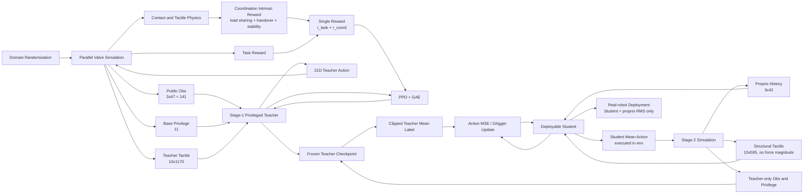
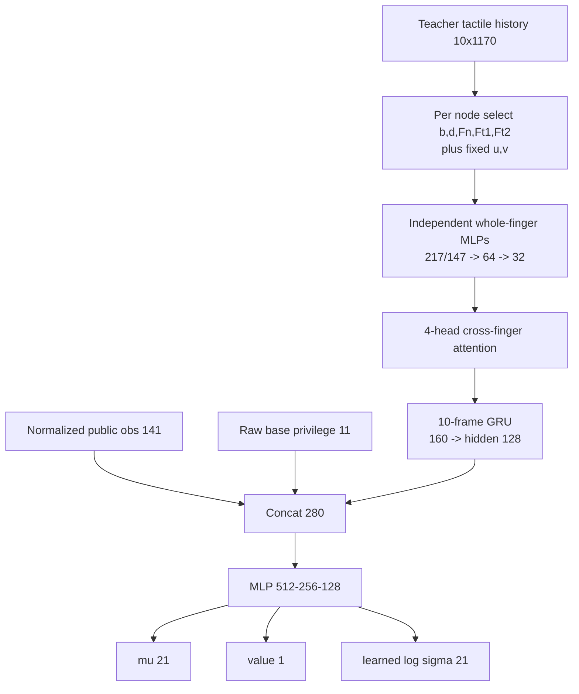
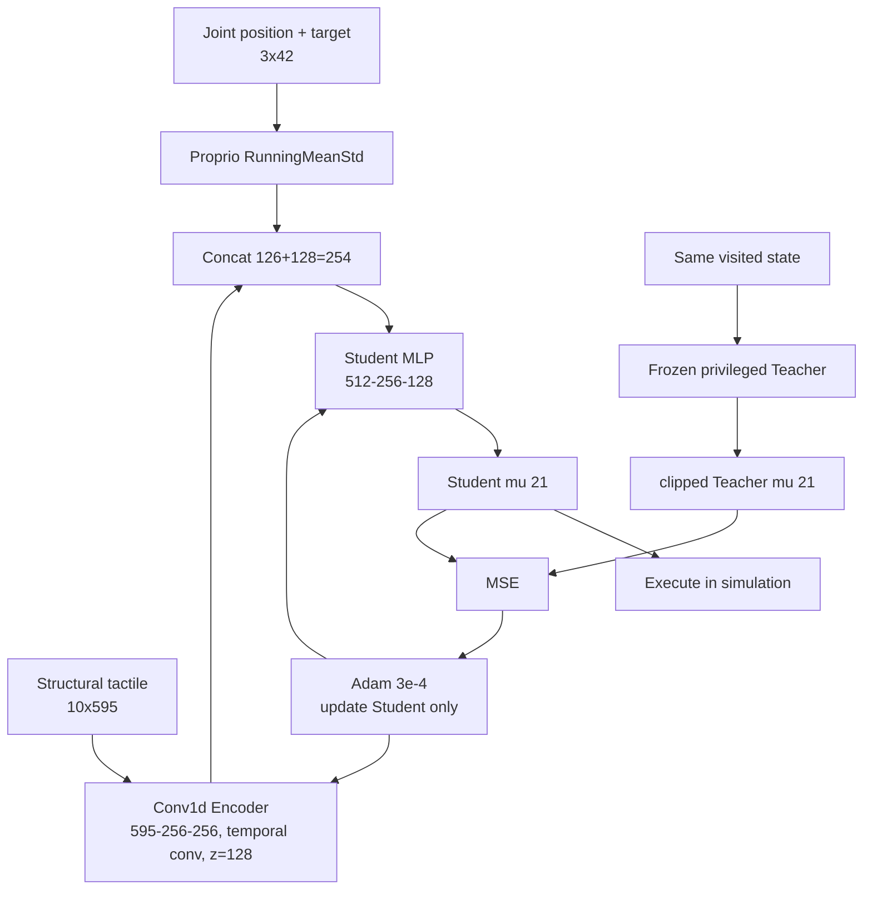
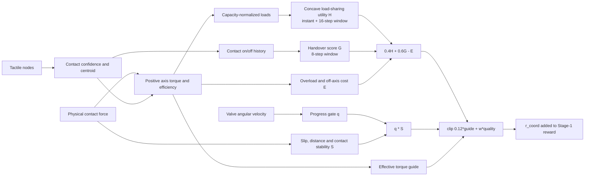

# `valvedriver_tactile` 触觉增强强化学习框架技术文档

> 文档目的：基于 [`REVO_HORA_SCREW_TASKS.md`](REVO_HORA_SCREW_TASKS.md) 与当前实现代码，整理 `valvedriver_tactile` 的训练算法、触觉数据链路、网络结构、奖励设计、教师—学生迁移和部署边界，为绘制算法框架图提供可直接使用的模块、箭头、张量尺寸与公式。
>
> 文件名按需求保留为 `tactie-enhancedRL.md`。本文只讨论不含机械臂末端自由度的五指阀门任务 `valvedriver_tactile`；`valvedriver_tactile_xy` 等层级主从任务不属于本文范围。

---

## 1. 一页结论

`valvedriver_tactile` 的触觉增强强化学习不是单一网络，而是一个两阶段的 privileged learning 框架：

1. **Stage‑1：触觉增强 PPO 教师**
   - 在大规模并行仿真中训练 21 维灵巧手策略。
   - 教师可使用仿真专属的物体状态、材料参数和三维触觉力。
   - 触觉还被用于构造多指负载分担、手指交接、有效轴向力矩和防滑稳定性的内生奖励。
   - 当前有两种互斥教师结构：默认 **MLP Force Oracle**，以及显式选择的 **Frame813 结构化时空教师**。

2. **Stage‑2：可部署触觉学生 TactileDAgger**
   - 冻结 Stage‑1 教师。
   - 学生只读取关节本体历史和**不含力幅值**的结构化触觉历史。
   - 每一步都由学生动作驱动环境；教师只为学生访问到的状态生成确定性动作标签。
   - 默认损失为 `MSE(student_mu, teacher_mu)`，不使用 Stage‑1 的触觉内生奖励更新学生。

3. **部署**
   - 只保留学生、关节历史归一化统计量和真实触觉预处理。
   - 不需要物体真值、摩擦/质量/质心、三维仿真力、奖励模块或在线教师。

建议总图标题为：

> **Tactile-Enhanced Privileged Reinforcement Learning with Force-Oracle Teacher and Structural-Tactile DAgger Student**

最需要在图中表达的主线是：

```text
仿真触觉与域随机化
  -> Stage-1 特权触觉教师 + 触觉内生协作奖励 + PPO
  -> 冻结教师 checkpoint
  -> 学生策略访问状态 + 教师动作监督 + DAgger
  -> 仅结构触觉与本体感觉的部署策略
```

---

## 2. 任务与闭环控制接口

### 2.1 任务定义

| 项目 | 当前实现 |
|---|---|
| 任务名 | `valvedriver_tactile` |
| 操作对象 | 名义外接半径 35 mm 的阀门手柄 |
| 活动手指 | 拇指、食指、中指、无名指、小指 |
| 灵巧手动作维度 | 21 |
| 物理仿真频率 | 240 Hz，`dt = 1/240 s` |
| 控制降采样 | `decimation = 12` |
| 策略频率 | 20 Hz |
| 单回合长度 | 40 s，即 800 个控制步 |
| 动作范围 | 每维裁剪到 `[-1, 1]` |

环境入口由 [`scripts/hora/train.py`](scripts/hora/train.py) 将任务映射到：

- 配置类：`Revo3HandVavleDriverTactileEnvCfg`
- 环境类：`Revo3HandScrewTactileEnv`
- 基础阀门配置：[`revo3_hand_screw_env_cfg.py`](source/BrainCo_DexHand/BrainCo_DexHand/tasks/direct/hora_screw/revo3_hand_screw_env_cfg.py)
- 触觉扩展配置：[`revo3_hand_screw_tactile_env_cfg.py`](source/BrainCo_DexHand/BrainCo_DexHand/tasks/direct/hora_screw/revo3_hand_screw_tactile_env_cfg.py)
- 基础动力学与奖励：[`revo3_hand_screw_env.py`](source/BrainCo_DexHand/BrainCo_DexHand/tasks/direct/hora_screw/revo3_hand_screw_env.py)
- 触觉观测与内生奖励：[`revo3_hand_screw_tactile_env.py`](source/BrainCo_DexHand/BrainCo_DexHand/tasks/direct/hora_screw/revo3_hand_screw_tactile_env.py)

### 2.2 动作到关节力矩

策略输出 `a_t in [-1,1]^21`，不是直接力矩，而是关节目标位置的增量：

```text
q_target,t = clip(q_target,t-1 + a_t / 24, q_lower, q_upper)
```

随后在每个物理子步使用显式 PD：

```text
tau_t = Kp (q_target,t - q_t) - Kd qdot_t
Kp = 3.0, Kd = 0.01
```

每个环境在 reset 时采样连续动作延迟 `delta ~ U(0,1)`。一个控制周期的前 `delta * 12` 个物理子步继续使用上一目标，其余子步使用新目标。这个机制应在图中画在“策略动作”和“PD 控制器”之间，表示 actuator latency randomization。

---

## 3. 整体两阶段训练框架

### 3.1 Stage‑1：触觉增强 PPO 教师

Stage‑1 同时利用三类信息：

- 公开观测 `o_t`：关节、目标和五指粗粒度接触；
- 基础特权 `p_t`：仿真物体位姿/速度和随机化参数；
- 详细触觉 `x_t^T`：每个物理触觉节点的三维力、接触结构和时间信息。

教师输出高斯策略 `pi_T(a_t | o_t, p_t, x_t^T)` 和价值 `V_T`，通过 PPO 学习。环境奖励为基础任务奖励与触觉内生协作奖励之和：

```text
r_t = r_task,t + r_coord,t
```

默认配置 `separate_coord_advantage: false`，所以二者进入同一个 return、同一个 value baseline 和同一个 advantage 流。

### 3.2 Stage‑2：TactileDAgger 学生

学生策略受到严格的可部署传感约束：

```text
pi_S(a_t | h_t^q, h_t^B)
```

其中：

- `h_t^q`：3 帧关节位置与当前目标历史；
- `h_t^B`：10 帧无力幅值结构触觉历史。

Stage‑2 的实际交互逻辑是：

```text
学生观察当前状态 -> 学生均值动作驱动环境
                    -> 冻结教师对同一状态生成动作标签
                    -> 更新学生以拟合教师动作
```

因此它是**学生状态分布上的在线 DAgger 式监督**。当前实现每轮使用新采集 rollout，CPU 暂存后打乱训练；没有跨迭代持续增长的长期 replay dataset。框架图宜画“rollout batch / temporary dataset”，不宜画成永久经验池。

### 3.3 训练—部署的信息不对称

| 信息 | Stage‑1 教师 | Stage‑2 学生 | 部署 |
|---|:---:|:---:|:---:|
| 21 维关节位置 | 是 | 是，3 帧历史 | 是 |
| 21 维关节目标 | 是 | 是，3 帧历史 | 是 |
| 五指粗接触力幅值 | 是，位于 141 维公开观测 | 否 | 否 |
| 物体位置偏差、角度、角速度 | 是 | 否 | 否 |
| 摩擦、质量、质心 | 是 | 否 | 否 |
| 三维节点触觉力 | 是 | 否 | 否 |
| 结构触觉 `[b,on,off,d,eta]` | 是 | 是 | 是 |
| Teacher 网络 | 本体 | 冻结打标签 | 否 |
| 触觉内生奖励 | 是 | 显式关闭 | 否 |

该表就是整张算法图最重要的“特权信息隔离线”。

---

## 4. 触觉传感与特征工程

### 4.1 物理触觉布局

训练 YAML 使用：

```yaml
tactile_layout: estimated_official
```

布局由 [`tactile_layout.py`](source/BrainCo_DexHand/BrainCo_DexHand/tasks/tactile_layout.py) 提供。五指物理节点数为：

| 手指 | 节点数 |
|---|---:|
| 拇指 | 31 |
| 食指 | 21 |
| 中指 | 21 |
| 无名指 | 21 |
| 小指 | 21 |
| 合计 | 115 |

每个物理节点首先由 TacSL 聚合出：

```text
[Fn, Ft1, Ft2]
```

- `Fn >= 0`：法向压缩力；
- `Ft1, Ft2`：两个局部切向剪切分量；
- 统一乘 `tactile_force_scale = 200`；
- 每个分量裁剪到 `[-5,5]`，并再次保证 `Fn >= 0`。

### 4.2 公共结构通道

对每个节点构造五个教师/学生共享的结构通道：

```text
[b, on, off, duration, eta]
```

含义如下：

| 通道 | 定义与作用 |
|---|---|
| `b` | 带滞回的二值接触状态；on 阈值 `0.001`，off 阈值 `0.0005` |
| `on` | 本步从非接触切换为接触 |
| `off` | 本步从接触切换为非接触 |
| `duration` | 连续接触时长的对数归一化，`tau=20`、最大时长 100 步 |
| `eta` | 节点相对接触质心的位置，在接触质心 EMA 位移方向上的投影，用于描述接触斑块的迁移方向 |

`duration` 的图节点路径计算为：

```text
d = clip(log(1 + n_contact/20) / log(1 + 100/20), 0, 1)
```

每根手指还追加四维上下文：

```text
[shift_u, shift_v, shift_valid, contact_ratio]
```

其中二维 shift 是接触质心位移经 `shift_max=0.2` 归一化并以 `beta=0.7` 做 EMA 的结果；`contact_ratio` 是该手指激活节点比例。

### 4.3 Teacher 触觉帧

Teacher 每个节点额外获得五个力相关通道：

```text
[Fn, Ft1, Ft2, delta_Fn, delta_|Ft|]
```

因此单节点 10 维：

```text
[b, on, off, duration, eta, Fn, Ft1, Ft2, delta_Fn, delta_|Ft|]
```

五指 Teacher 单帧宽度为：

```text
115 nodes * 10 + 5 fingers * 4 context = 1170
```

Teacher 历史张量：

```text
x_t^T: [B, 10, 1170]
```

### 4.4 Student 触觉帧

Student 故意删除所有力幅值与力差分，只保留：

```text
115 nodes * [b,on,off,duration,eta] + 5 * context
```

单帧宽度：

```text
115 * 5 + 5 * 4 = 595
```

学生历史张量：

```text
x_t^S: [B, 10, 595]
```

这是 sim-to-real 设计的核心：学生学习接触事件、持续时间和接触斑块运动，而不是依赖仿真力值的精确标定。

### 4.5 触觉历史初始化

reset 后，环境不是让十帧历史长期保持全零，而是在首次观测计算时将当前触觉帧复制到所有历史槽：

```text
[x_t, x_t, ..., x_t]  共 10 帧
```

这样可避免新回合开始时的零填充产生非物理的强时间边缘。

### 4.6 触觉噪声

默认启用两类独立扰动：

- Teacher 三维力：添加大小约为 `0.05 * |F|` 的随机方向噪声；
- Student 接触位：每个 `b` 以 `0.05` 概率翻转，随后 `on/off/duration/eta/context` 按扰动后的结构状态演化。

此外，公开观测中的五个粗接触力还单独使用 2% 相对方向噪声、平滑和随机延迟。它与物理节点触觉噪声不是同一条数据链。

---

## 5. 所有关键张量尺寸

### 5.1 公开观测

每个公开观测帧：

```text
21 noisy normalized joint positions
+ 21 current joint targets
+ 5 smoothed fingertip contact magnitudes
= 47
```

取最近三帧：

```text
o_t: [B, 3 * 47] = [B, 141]
```

### 5.2 基础特权信息

`priv_info` 的前 11 维为：

| 索引 | 内容 |
|---|---|
| `0:3` | 物体参考点相对默认位置的三维偏差 |
| `3` | 随机材料摩擦系数 |
| `4` | 随机物体质量 |
| `5:8` | 随机质心偏移 |
| `8` | `sin(theta_valve)` |
| `9` | `cos(theta_valve)` |
| `10` | `clip(omega,-10,10)/10` |

当前 Teacher 触觉帧追加到 `priv_info` 尾部：

```text
priv_info: 11 + 1170 = 1181
```

### 5.3 学生本体感觉

学生从 47 维历史帧中只截取前 42 维：

```text
21 joint positions + 21 current joint targets
```

三帧历史为：

```text
h_t^q: [B,3,42] -> flatten -> [B,126]
```

五个粗接触力不进入学生本体输入。

### 5.4 总尺寸表

| 符号/键 | 尺寸 | 使用者 |
|---|---:|---|
| `obs` | `[B,141]` | Stage‑1 Teacher |
| 基础 `priv_info` | `[B,11]` | Teacher |
| 完整 `priv_info` | `[B,1181]` | MLP Teacher；Frame813 只取前 11 维 |
| `tactile_hist` | `[B,10,1170]` | Frame813 Teacher |
| `student_proprio_hist` | `[B,3,42]` | Student |
| `student_tactile_hist` | `[B,10,595]` | Student |
| Teacher/Student 动作 | `[B,21]` | 环境与 DAgger 标签 |

时间尺度上，10 帧触觉历史在 20 Hz 下约覆盖 0.5 s，3 帧本体历史约覆盖 0.15 s。

---

## 6. 触觉增强机制一：Teacher 的触觉感知

当前代码提供两条 Stage‑1 教师分支。它们共享环境、奖励和 PPO，但触觉编码方式不同。绘图时应使用“Teacher encoder selectable”虚线分叉，不能把两条路径串联。

### 6.1 默认分支：MLP Force Oracle

配置文件：[`Revo3HandScrewTactile.yaml`](source/BrainCo_DexHand/BrainCo_DexHand/tasks/direct/hora_screw/agents/Revo3HandScrewTactile.yaml)

```yaml
tactile_encoder:
  type: mlp
```

数据流：

```text
full priv_info [1181]
  -> MLP 1181 -> 256 -> 128 -> 32
  -> tanh
  -> concat(normalized obs [141])
  -> actor input [173]
  -> MLP 173 -> 512 -> 256 -> 128
  -> mu [21], log_sigma [21], value [1]
```

实现特征：

- `priv_info` 中包含**当前** 1170 维详细触觉帧；
- 默认 MLP 路线不读取独立的十帧 `tactile_hist`；
- 物体特权和触觉力先一起压缩成 32 维 oracle embedding；
- 它是当前无 `--train_cfg` 时 `valvedriver_tactile` 的默认 Stage‑1 路线。

### 6.2 显式分支：Frame813 结构化时空 Teacher

配置文件：[`valvedriver_tactile_frame813.yaml`](source/BrainCo_DexHand/BrainCo_DexHand/tasks/direct/hora_screw/agents/valvedriver_tactile_frame813.yaml)

```yaml
tactile_encoder:
  type: finger_attention_gru
```

#### 6.2.1 节点选择

原始 Teacher 节点有 10 个动态通道。Frame813 仅选择索引 `[0,3,5,6,7]`：

```text
[b, duration, Fn, Ft1, Ft2]
```

再加入每个物理节点的固定归一化坐标 `[u,v]`：

```text
[u,v,b,duration,Fn,Ft1,Ft2]  共 7 维
```

坐标按手指独立去均值，并用该手指最大节点间距归一化。坐标注册为模型 buffer，forward 时不读 JSON、不重新计算几何距离。

#### 6.2.2 空间与时间编码

```text
Teacher history [B,10,1170]
  -> 去掉末尾 5*4 context
  -> [B,10,115,10]
  -> 选 5 个动态通道 + 拼接 u/v
  -> [B,10,115,7]
```

按手指切分后，每根手指使用**不共享参数**的 whole-finger MLP：

```text
thumb : 31*7=217 -> 64 -> 32
others: 21*7=147 -> 64 -> 32
```

之后：

```text
5 finger tokens [B,10,5,32]
  + finger identity embedding
  -> 每一时刻跨手指 4-head self-attention, FF dim 64
  -> 保留全部 5 tokens 并展平为 [B,10,160]
  -> 单层、单向 GRU, hidden=128
  -> 最终触觉 latent z_T [B,128]
```

#### 6.2.3 Actor 融合

```text
normalized public obs [141]
+ raw base privilege [11]
+ tactile latent [128]
= actor input [280]
```

Actor/Critic 共享 trunk：

```text
280 -> 512 -> 256 -> 128
  -> mu [21]
  -> learnable log_sigma [21]
  -> value [1]
```

注意：

- 基础 11 维特权原样拼接，不经过 MLP、归一化、`tanh` 或 LayerNorm；
- `priv_info` 尾部的当前详细触觉帧不参与 Frame813 forward；
- Frame813 使用独立 `tactile_hist [B,10,1170]`；
- 20 维 finger context、`on/off/eta` 和两个力差分通道当前均不进入 Frame813 编码器；
- 结构化触觉编码器的 PPO 学习率默认为主学习率的 `0.3`，即主干 `1e-3` 时编码器为 `3e-4`；
- MLP 与 Frame813 checkpoint 进行严格架构校验，不能互换加载。

### 6.3 两种教师的比较

| 项目 | MLP Force Oracle | Frame813 Teacher |
|---|---|---|
| 启用配置 | `Revo3HandScrewTactile` | `valvedriver_tactile_frame813` |
| 触觉时间建模 | 无，使用当前帧 | 10 帧 GRU |
| 空间先验 | 无，整段展平 | 真实节点坐标、按指独立 MLP、跨指注意力 |
| Teacher 输入 | `obs141 + MLP(priv1181)->32` | `obs141 + base_priv11 + tactile_latent128` |
| Actor 输入宽度 | 173 | 280 |
| 适合在主图中的角色 | 基线 / Force Oracle | 结构化触觉教师主分支 |

如果框架图强调触觉算法创新，建议主图绘制 Frame813；将 MLP Force Oracle 放在旁边作为灰色虚线 baseline。若展示仓库默认运行行为，则必须注明默认仍为 MLP 教师。

---

## 7. 触觉增强机制二：多指内生协作奖励

### 7.1 奖励总结构

基础阀门任务奖励：

```text
r_task = 6*r_rot - 0.3*r_overspeed - 0.1*r_tau - 0.01*r_work + 2*r_prox
```

其中：

```text
r_rot       = clip(omega, -4, 4)
r_overspeed = max(omega - omega_threshold, 0)
r_tau       = sum_i tau_i^2
r_work      = (sum_i |tau_i| |qdot_i|)^2
r_prox      = clip(1 - mean_finger_distance/0.08, 0, 1)
```

阀门任务具有以下特化：

- `omega_threshold` 从 7.5 rad/s 在 30M～60M agent steps 课程化提高到 15 rad/s；
- `pose_diff_penalty_scale = 0`，允许五指离开初始抓姿形成步态；
- proximity 使用全部五根手指；
- 不使用 thumb/index 距离终止，但保留停滞、无接触、物体关节上限和 timeout 终止。

触觉增强总奖励：

```text
r_total = r_task + r_coord
```

35 mm `valvedriver_tactile` 当前配置中：

- `enable_coord_endogenous_reward = true`；
- 旧版 `multi_contact_reward_scale = 0`；
- `enable_visible_contact_reward = false`。

所以需要在主图中突出的是新的 `r_coord`，不是 legacy multi-contact bonus 或 visible-contact reward。

### 7.2 每指接触和有效任务贡献

对每根手指 `i`：

1. 统计激活物理触觉节点数，按 `n_sat=6` 饱和得到触觉置信度；
2. 与物理 ContactSensor 置信度取最大值，得到 `b_i`；
3. 使用触觉力加权质心或物理接触点得到 `p_i`；
4. 计算接触点相对阀门轴的力臂 `r_i`；
5. 将手指接触力转成作用于物体的力 `F_i^obj`；
6. 计算阀门目标轴上的有符号力矩：

```text
tau_axis,i = axis dot (r_i cross F_i^obj)
tau_i+     = max(tau_axis,i, 0)
e_axis,i   = tau_i+ / ||r_i cross F_i^obj||
```

有效力矩为：

```text
tau_eff,i = tau_i+ * e_axis,i^1.0
```

它只奖励正方向且沿目标旋转轴有效的力矩，反向和离轴力被排除或进入 waste cost。

### 7.3 容量归一化与负载分担 `H`

名义半径随环境物体尺度变化：

```text
R_i = 0.035 * object_radius_scale
F_comfort = 2.5 N
C_nom,i = R_i * F_comfort
```

实际接触力臂会修正手指容量：

```text
lever_ratio_i = clip(rho_i/R_i, 0.25, 1.50)
C_i = C_nom,i * lever_ratio_i
load_i = clip(tau_eff,i/C_i, 0, 3)
```

瞬时凹效用：

```text
H_inst = sum_i C_i * (1 - exp(-load_i/0.5)) / sum_i C_nom,i
```

凹函数使固定总力矩被多个有能力的手指合理分担时获得更高边际收益，但不强制每根手指贡献相同绝对力矩。

短时窗口保存最近 16 个控制步的 normalized load，形成 `H_window`，最终：

```text
H = 0.60*H_inst + 0.40*H_window
```

16 步历史使顺序换指步态也能获得 credit，而不是只奖励同一时刻所有手指同时压紧。

`H` 还乘以有效正力矩 presence gate。训练早期 presence floor 从 1 逐渐降为 0，以便尚未形成明显旋转前仍有稠密引导。

### 7.4 换指交接得分 `G`

用 `b_i=0.2` 作为接触建立/释放阈值。若某根新接触手指 `j` 建立接触，而另一根手指 `i` 在最近 `Delta_h=8` 个控制步内释放，则产生：

```text
G = max_(i != j) [new_contact_j * recent_release_i * exp(-release_age_i/8)]
```

阀门任务使用：

```text
alpha_H = 0.4
alpha_G = 0.6
```

这说明设计更偏向连续 handover/gaiting，而不是静态五指同时用力。

### 7.5 进度门和稳定性门

正向角速度取最近 5 步均值，构造任务进度：

```text
q_raw = clip((omega_bar - 0.05/R_scale) /
             (1.0/R_scale - 0.05/R_scale), 0, 1)
q_task = q_raw^2
q_guide = q_floor + (1-q_floor)*q_task
```

`q_floor` 在 0～15M agent steps 从 0.20 线性降为 0，使训练后期协作质量必须伴随真实阀门旋转。

稳定性门：

```text
S = S_slip * S_distance * S_object_contact
S_slip = exp(-0.75 * v_slip / 0.04)
```

- `S_slip` 抑制切向滑移；
- `S_distance` 抑制手指远离阀门；
- `S_object_contact` 抑制物体失去接触；
- 距离和接触门保留 0.05 floor，避免早期完全无梯度信号。

### 7.6 过载、离轴浪费与稠密有效力矩引导

代价项：

```text
E = 0.20 * overload + 0.10 * waste
```

- `overload`：接触力超过舒适力 2.5 N 后的有界二次惩罚；
- `waste`：总力矩中未形成正轴向力矩的部分，经容量归一化后的有界惩罚。

为解决阀门尚未运动时 `q` 和稳定门过弱的问题，另设固定有效力矩引导：

```text
tau_norm = sum_i tau_eff,i / sum_i C_nom,i
g_tau = sqrt(clip(tau_norm / 0.005, 0, 1))
r_tau_guide = 0.12 * g_tau
```

### 7.7 最终内生奖励

协作质量：

```text
Q_coord = q_guide * S * (0.4*H + 0.6*G - E)
```

质量权重课程：

```text
0M -> 5M:   0.10 -> 0.30
5M -> 60M:  0.30
60M -> 90M: 0.30 -> 0.18
90M+:        0.18
```

最终：

```text
r_coord = clip(0.12*g_tau + w_quality*Q_coord, -1, 1)
```

绘图时建议将内生奖励画成四条并行特征支路：

```text
触觉/接触 -> 有效轴向力矩与容量 -> H 负载分担 ----┐
接触事件历史 -----------------------> G 换指交接 ----┤
物体角速度 ------------------------> q 任务进度 -----┤-> Q_coord -> r_coord
滑移/距离/接触 --------------------> S 稳定性 -------┘
过载与离轴力矩 --------------------> E 代价 ---------┘
有效轴向力矩 ----------------------> 固定 guide -----┘
```

### 7.8 为什么只在 Stage‑1 使用

[`tactile_dagger.py`](source/BrainCo_DexHand/BrainCo_DexHand/algo/hora/padapt/tactile_dagger.py) 在构造 Stage‑2 trainer 时显式关闭环境的 `enable_coord_endogenous_reward` 和 `_coord_enabled`。这样：

- Teacher 已经通过 Stage‑1 reward shaping 学到多指协调行为；
- Student 通过动作标签继承该行为；
- Stage‑2 不再让仿真专属接触力奖励直接优化可部署学生；
- 默认纯 DAgger 下，环境 reward 只用于评估和选择 `model_best.ckpt`。

---

## 8. Stage‑1 PPO 优化细节

### 8.1 rollout

每个控制步：

```text
环境观测
  -> 只对 public obs 做 RunningMeanStd
  -> Teacher 输出 mu, sigma, V
  -> 采样 a ~ Normal(mu,sigma)
  -> clip(a,-1,1)
  -> env.step(a)
  -> 存储 obs / priv_info / tactile_hist / a / logp / V / r / done
```

只有 Frame813 路线在 [`experience.py`](source/BrainCo_DexHand/BrainCo_DexHand/algo/hora/ppo/experience.py) 中额外存储 `[10,1170]` 的 Teacher tactile history；MLP Teacher 不使用该 rollout 字段。

### 8.2 GAE 与 PPO

```text
delta_t = r_t + gamma*(1-done_t)*V(s_t+1) - V(s_t)
A_t = delta_t + gamma*lambda*(1-done_t)*A_t+1
```

默认：

```text
gamma = 0.99
lambda = 0.95
horizon = 8
clip epsilon = 0.2
critic coefficient = 4
entropy coefficient = 0
bounds loss coefficient = 1e-4
gradient norm = 1.0
```

优化目标由 clipped policy loss、clipped value loss、entropy 和 action-bound regularization 组成；学习率根据 KL threshold `0.01` 自适应调整。

`reward_scale=1.0`，触觉协作奖励不会额外缩放。`normalize_input=true` 只归一化 141 维 public obs；基础特权与触觉输入保持原始编码尺度。价值与 advantage 均归一化。

### 8.3 并行批次

典型 Stage‑1 使用 4096 个环境：

```text
rollout batch = 4096 envs * 8 steps = 32768 samples
```

- MLP YAML 首选 minibatch 32768；
- Frame813 YAML 使用 minibatch 4096；
- `train.py` 会把 minibatch 调整成 rollout batch 的精确因数。

---

## 9. Stage‑2 学生网络

### 9.1 默认 Conv1d 学生

默认配置在 `Revo3HandScrewTactile.yaml` 与 `valvedriver_tactile_frame813.yaml` 中相同：

```yaml
student_tactile_encoder:
  type: conv1d
  gated_fusion: false
  output_dim: 128
  distill_dim: 32
```

触觉编码：

```text
[B,10,595]
  -> per-frame Linear 595 -> 256 -> 256, ReLU
  -> transpose to [B,256,10]
  -> Conv1d 256->256, kernel=4, stride=2: T 10->4
  -> Conv1d 256->256, kernel=4, stride=1: T 4->1
  -> Linear 256->128
  -> tactile embedding z_S [B,128]
```

融合与策略：

```text
proprio history [B,3,42] -> flatten [B,126]
tactile z_S [B,128]
concat -> [B,254]
MLP 254 -> 512 -> 256 -> 128
mu_S [B,21]
```

网络还定义了 value head、可学习 action log-std 和 `128->32` 的 distill projection，但在当前默认纯 DAgger 路径中：

- 行为直接使用确定性 `mu_S`；
- value/log-std 仅供可选 Stage‑2 PPO；
- distill projection 因 `tactile_distill_coef=0` 不产生训练作用。

### 9.2 可选 GRU 学生

配置：[`Revo3HandScrewTactileGRU.yaml`](source/BrainCo_DexHand/BrainCo_DexHand/tasks/direct/hora_screw/agents/Revo3HandScrewTactileGRU.yaml)

```text
[B,10,595]
  -> per-frame 595 -> 256 -> 256
  -> bidirectional GRU, hidden 256 per direction
  -> last temporal output [512]
  -> projection 512 -> 64
  -> z_S [64]
```

GRU 变体启用 gated fusion：

```text
proprio126 -> Linear -> base512
tactile64  -> projection512
gate = sigmoid(Linear([base512,tactile64]))
fused = base + gate * tactile_projection
fused512 -> MLP 256 -> 128 -> mu21
```

该变体的有效学生逻辑输入宽度是 `126+64=190`。默认 Conv1d YAML 覆盖输出为 128，因此有效宽度是 254；trainer 会以实际 encoder output 重新核验，而不是盲信环境初始占位值 `student_obs_dim=190`。

### 9.3 归一化

- Student proprio history 使用独立的在线 `RunningMeanStd([3,42])`；
- structural tactile history 保持原值，不做全局 RunningMeanStd；
- 部署必须随 checkpoint 恢复 `proprio_mean_std`，并保持相同关节顺序、单位和目标定义。

---

## 10. Stage‑2 TactileDAgger 算法

### 10.1 Teacher 冻结与 checkpoint 对齐

Stage‑2 使用与 Stage‑1 完全相同的 `--train_cfg` 重建 Teacher，并严格加载：

- Teacher 权重；
- Teacher public observation RunningMeanStd；
- Teacher 架构类型和 Frame813 几何 signature。

所有 Teacher 参数 `requires_grad=false`，且不会进入学生 optimizer。

Teacher 与 Student 的触觉编码器是独立架构。即使配置请求 warm start，当前实现也会输出提示并跳过权重拷贝，学生从头训练。

### 10.2 单步数据流

在默认纯 DAgger 模式下，每个 rollout step 为：

```text
1. q_hist_norm = RMS(student_proprio_hist)
2. x_struct = student_tactile_hist
3. mu_S = Student(q_hist_norm, x_struct)
4. mu_T = clip(FrozenTeacher(RMS(obs), priv_info, teacher_tactile_hist), -1, 1)
5. env.step(clip(mu_S, -1, 1))
6. 保存 (q_hist_norm, x_struct, mu_T)
```

关键事实：

- **环境执行 Student 动作**；
- Teacher 动作不执行，只作为标签；
- 没有 `beta*teacher + (1-beta)*student` 的动作混合；
- Teacher 和 Student 针对同一个交互前状态计算动作；
- 这保证监督覆盖学生实际会访问的状态分布。

### 10.3 默认损失

```text
L_mu = mean ||mu_S - clip(mu_T,-1,1)||^2
L_stage2 = L_mu
```

默认 YAML：

```text
tactile_distill_coef = 0
dagger_ppo_reward_enable = false  # 未配置时的代码默认值
```

因此当前标准路线是纯 action-mean imitation，不应在主框架图中把 latent loss 或 Stage‑2 PPO 画成实线必经模块。

### 10.4 当前可选但默认关闭的损失接口

代码预留：

```text
L = L_mu
  + lambda_z * L_z
  + w_actor * L_PPO_actor
  + w_critic * L_PPO_critic
```

- `L_z`：Student tactile projection 与 Teacher tactile latent 的 LayerNorm 后 MSE；
- `w_actor`、`w_critic`：按 Stage‑2 curriculum 分别 ramp；
- PPO action std cap 默认从 0.5 退火到 0.2；
- DAgger action loss 始终保持权重 1。

但当前实现中 `_teacher_has_tactile_latent` 初始化为 `false`，没有后续启用赋值。因此仅把 `tactile_distill_coef` 改为非零仍不会产生 latent target；若要把 latent distillation 作为正式算法，需要同步完善并测试该链路。

### 10.5 批次与优化

若 YAML 未设置专用 DAgger batch 参数，1024 个并行环境时默认解析为：

```text
rollout_steps = 1
rollout_batch = 1024
train_batch = 1024
microbatch = 1024
mini_epochs = 1
```

每个完整 rollout 先转移到 CPU，随后随机打乱；只有 learner microbatch 被送回 GPU，以控制峰值显存。

Student optimizer 是代码中固定的：

```text
Adam(student.parameters(), lr=3e-4)
```

因此 `Revo3HandScrewTactileGRU.yaml` 中 Stage‑1 `ppo.learning_rate=5e-3` 不控制 Stage‑2 student optimizer。

### 10.6 Stage‑2 checkpoint

`.ckpt` 保存：

- Student 参数；
- 冻结 Teacher 参数；
- Teacher public-observation RMS；
- Student proprio RMS；
- Student optimizer；
- agent steps 和 best reward；
- 仅当 Stage‑2 PPO 启用时保存 value RMS。

部署真正需要的是 Student 参数、Student proprio RMS、触觉布局/预处理元数据和控制接口；Teacher 被打包主要用于可恢复训练和一致性校验。

---

## 11. 域随机化与 sim-to-real 鲁棒性

### 11.1 动力学和几何随机化

| 随机化项 | 当前范围/方式 |
|---|---|
| Finger P gain | `[2.7,3.3]` |
| Finger D gain | `[0.009,0.011]` |
| 接触摩擦 | 早期上界 8.0，0～15M steps 退火到最终 `[0.5,2.0]` |
| 物体质量 | `[0.04,0.06] kg` |
| 物体质心 | 每轴 `[-0.002,0.002] m` |
| 被动物体关节摩擦 | `0.2 Nm * scale`，课程从 `1.0` 扩展到 `[0.75,1.5]` |
| 阀门 XY 半径尺度 | 离散 `{0.8,0.9,1.0,1.1,1.2}` |
| 物体 reset XY 位置 | 每轴 `[-0.005,0.005] m` |
| 持续随机外力 | scale 2.0、刷新概率 0.25、decay 0.9 |
| 动作延迟 | 每环境 `U(0,1)` 个控制周期 |

### 11.2 观测随机化

| 随机化项 | 当前设置 |
|---|---|
| Joint observation noise | `0.02` |
| 粗粒度 ContactSensor 力噪声 | 2% 相对噪声 |
| Teacher 节点三维力噪声 | 5% 相对噪声 |
| Student contact bit flip | 5% |
| 粗粒度接触 latency | `0.005` 概率保留上一值 |

域随机化与 DAgger 的分工应在图中区分：

- 域随机化扩大 Teacher 和 Student 在仿真中覆盖的动力学/传感变化；
- 特权 Teacher 解决探索与高质量技能学习；
- 结构触觉 Student 消除对难以迁移的精确力幅值和物体真值的依赖；
- DAgger 将 shaped Teacher 行为迁移到 Student 的受限观测空间。

---

## 12. 训练命令与产物

### 12.1 默认 MLP Teacher

```bash
python scripts/hora/train.py \
  --task valvedriver_tactile \
  --algo PPO \
  --train_cfg Revo3HandScrewTactile \
  --num_envs 4096 \
  --headless \
  --output_name valvedriver_tactile_mlp
```

输出：

```text
outputs/hora/revo3_right/<run>/stage1_nn/best.pth
```

### 12.2 Frame813 Teacher

必须从头训练，不能从 MLP Teacher checkpoint 恢复：

```bash
python scripts/hora/train.py \
  --task valvedriver_tactile \
  --algo PPO \
  --train_cfg valvedriver_tactile_frame813 \
  --num_envs 4096 \
  --headless \
  --output_name valvedriver35_tactile_frame813
```

### 12.3 Conv1d Student

Teacher 配置必须与 Stage‑1 checkpoint 相同。以下示例使用 Frame813 Teacher：

```bash
python scripts/hora/train.py \
  --task valvedriver_tactile \
  --algo ProprioAdapt \
  --train_cfg valvedriver_tactile_frame813 \
  --checkpoint outputs/hora/revo3_right/valvedriver35_tactile_frame813/stage1_nn/best.pth \
  --num_envs 1024 \
  --headless \
  --output_name valvedriver35_tactile_frame813_student
```

`train.py` 对触觉任务会把算法实现从一般 `ProprioAdapt` 替换成 `TactileDAgger`。

### 12.4 GRU Student

```bash
python scripts/hora/train.py \
  --task valvedriver_tactile \
  --algo ProprioAdapt \
  --train_cfg Revo3HandScrewTactileGRU \
  --checkpoint outputs/.../stage1_nn/best.pth \
  --num_envs 1024 \
  --headless \
  --output_name valvedriver_tactile_gru_student
```

该 YAML 的 Teacher 仍是 MLP，因此 checkpoint 也必须来自相同 MLP Teacher 配置。

### 12.5 Stage‑2 确定性测试

```bash
python scripts/hora/train.py \
  --task valvedriver_tactile \
  --algo ProprioAdapt \
  --train_cfg valvedriver_tactile_frame813 \
  --checkpoint outputs/.../stage2_nn/model_best.ckpt \
  --test \
  --num_envs 16 \
  --headless
```

测试时执行裁剪后的 Student `mu`，不采样动作。

---

## 13. 部署接口与现实触觉预处理要求

最终部署闭环建议画为：

```text
机器人关节编码器 ------------------------┐
  -> q 与 q_target 的 3 帧队列 -> RMS -----┤
真实触觉阵列 ----------------------------┤
  -> 节点映射 -> 滞回二值化               ├-> Student -> 21D delta target -> 限位 -> 20Hz 控制器
  -> on/off/duration                       ┤
  -> 质心 shift/eta/context -> 10 帧队列 --┘
```

真实系统必须复现以下契约：

1. 五指节点顺序严格为 `thumb31 + index21 + middle21 + ring21 + little21`；
2. 关节顺序与训练的 21 个 `actuated_joint_names` 完全一致；
3. `q`、`q_target` 使用与仿真相同单位和定义；
4. 从 checkpoint 恢复 `proprio_mean_std`；
5. 实现相同 on/off 滞回、接触事件、时长归一化和十帧队列；
6. 用真实传感器节点坐标计算接触质心、shift、`eta` 和四维 finger context；
7. 真实传感器阈值需要经过标定，使二值接触语义与仿真的 on/off 阈值一致；
8. Student 输出是增量关节目标，不是直接力矩；
9. 控制频率保持 20 Hz，底层控制器再将目标转成关节力矩或位置控制命令。

部署阶段不应出现：

- `priv_info`；
- 物体角度/角速度真值；
- 摩擦、质量、质心；
- Teacher force frame；
- Stage‑1 reward 或 PPO；
- 在线 Teacher inference。

---

## 14. 推荐算法框架图

### 14.1 总图 Mermaid 草图

下面的 Mermaid 可作为论文图的结构底稿。正式绘图时建议把 Stage‑1 置于左半区、Stage‑2 置于右半区、Deployment 放在底部，并用颜色区分 privileged / deployable 信号。



### 14.2 Teacher 内部结构草图



### 14.3 Student 与 DAgger 草图



### 14.4 内生奖励草图



---

## 15. 正式绘图的模块清单与视觉约定

### 15.1 建议保留的一级模块

1. Parallel Tactile Simulation
2. Domain Randomization
3. Tactile Feature Construction
4. Privileged Teacher Encoder
5. Coordination Intrinsic Reward
6. PPO / GAE
7. Frozen Teacher
8. Deployable Structural-Tactile Student
9. Student-executed Rollout
10. Teacher Action Label
11. DAgger Action Loss
12. Real-Robot Deployment

### 15.2 颜色建议

| 颜色 | 含义 |
|---|---|
| 红/橙 | 仿真特权信息与 Teacher force channels |
| 蓝 | 可部署本体感觉 |
| 绿 | 可部署结构触觉 |
| 紫 | Teacher/Student 神经网络 |
| 黄 | reward、loss 和 optimizer |
| 灰虚线 | 默认关闭或可选模块，如 latent distillation、Stage‑2 PPO、MLP baseline |

### 15.3 箭头语义

- 实线数据箭头：当前默认必经的数据；
- 回环箭头：环境交互或参数更新；
- 点划线：checkpoint 迁移；
- 灰色虚线：可选/默认关闭；
- 在 Student action 到环境的箭头上明确标 `executed`；
- 在 Teacher action 到 loss 的箭头上明确标 `label only`；
- Stage‑1 reward 到 Stage‑2 Teacher checkpoint 是“行为迁移”关系，不要直接把 `r_coord` 接到 Student loss。

### 15.4 论文图中容易画错的地方

1. 不要把 MLP Teacher 和 Frame813 Teacher 串联；二者是可选分支。
2. 不要把 Teacher action 画成 Stage‑2 环境执行动作；实际执行 Student `mu`。
3. 不要给 Student 输入三维力或五个粗接触力。
4. 不要把 `r_coord` 画进默认 Stage‑2 优化；TactileDAgger 显式关闭它。
5. 不要把 latent distillation 画成当前默认实线损失；配置系数为零且代码开关未启用。
6. 不要把 Stage‑2 数据容器画成跨训练全程累积的 replay buffer；当前只缓存本轮 rollout。
7. 不要把 Frame813 的 20 维 finger context 画进其 encoder；环境生成了它，但当前 Frame813 forward 丢弃。
8. 不要将 Student 输出标成关节力矩；它是 21 维增量位置目标。
9. 不要忽略 public obs、Teacher tactile 和 Student tactile 是三条不同接口。

---

## 16. 当前实现边界与后续可扩展点

### 16.1 当前已生效

- 115 个物理节点 `estimated_official` 布局；
- Teacher/Student 分离的触觉帧；
- MLP Force Oracle；
- Frame813 whole-finger MLP + finger attention + temporal GRU；
- capacity-aware endogenous coordination reward；
- 单 return PPO；
- Student-executed TactileDAgger；
- Conv1d 与 GRU Student；
- checkpoint 架构和张量尺寸校验；
- Stage‑2 禁用 coordination shaping；
- 面向部署的无力幅值 structural tactile。

### 16.2 代码存在但默认未生效

- Student latent distillation；
- Stage‑2 PPO actor/critic auxiliary loss；
- Student stochastic exploration 与 std curriculum；
- legacy multi-contact reward；
- valve visible-contact reward；
- Teacher-to-Student tactile encoder warm start。

### 16.3 可作为后续实验的消融

| 消融 | 要回答的问题 |
|---|---|
| 无 `r_coord` | 触觉协作 shaping 对旋转速度、换指频率和稳定性的贡献 |
| `alpha_H=1, alpha_G=0` | 静态负载分担与 handover 的相对作用 |
| 去掉 16-step load window | 顺序步态 credit 是否下降 |
| MLP Teacher vs Frame813 | 显式物理布局和时空编码的收益 |
| Conv1d vs GRU Student | 时间模型与 gated fusion 的收益 |
| Student 使用力幅值 | 精确力值是否提高仿真性能但损害 sim-to-real |
| 无 tactile bit flip/noise | 传感随机化对真实鲁棒性的贡献 |
| Teacher action rollout vs Student action rollout | covariate shift 对部署性能的影响 |

---

## 17. 关键代码索引

| 功能 | 文件 |
|---|---|
| 总体任务说明与命令 | [`REVO_HORA_SCREW_TASKS.md`](REVO_HORA_SCREW_TASKS.md) |
| 训练入口、任务映射、运行时维度同步 | [`scripts/hora/train.py`](scripts/hora/train.py) |
| 基础阀门环境配置 | [`revo3_hand_screw_env_cfg.py`](source/BrainCo_DexHand/BrainCo_DexHand/tasks/direct/hora_screw/revo3_hand_screw_env_cfg.py) |
| 基础控制、观测、奖励、随机化 | [`revo3_hand_screw_env.py`](source/BrainCo_DexHand/BrainCo_DexHand/tasks/direct/hora_screw/revo3_hand_screw_env.py) |
| 触觉尺寸、噪声、协作奖励参数 | [`revo3_hand_screw_tactile_env_cfg.py`](source/BrainCo_DexHand/BrainCo_DexHand/tasks/direct/hora_screw/revo3_hand_screw_tactile_env_cfg.py) |
| Teacher/Student 触觉帧和内生奖励 | [`revo3_hand_screw_tactile_env.py`](source/BrainCo_DexHand/BrainCo_DexHand/tasks/direct/hora_screw/revo3_hand_screw_tactile_env.py) |
| 真实物理节点布局 | [`tactile_layout.py`](source/BrainCo_DexHand/BrainCo_DexHand/tasks/tactile_layout.py) |
| Teacher、Frame813、Student 网络 | [`models.py`](source/BrainCo_DexHand/BrainCo_DexHand/algo/hora/models/models.py) |
| Stage‑1 PPO | [`ppo.py`](source/BrainCo_DexHand/BrainCo_DexHand/algo/hora/ppo/ppo.py) |
| PPO rollout buffer | [`experience.py`](source/BrainCo_DexHand/BrainCo_DexHand/algo/hora/ppo/experience.py) |
| Stage‑2 TactileDAgger | [`tactile_dagger.py`](source/BrainCo_DexHand/BrainCo_DexHand/algo/hora/padapt/tactile_dagger.py) |
| 默认 MLP Teacher + Conv Student | [`Revo3HandScrewTactile.yaml`](source/BrainCo_DexHand/BrainCo_DexHand/tasks/direct/hora_screw/agents/Revo3HandScrewTactile.yaml) |
| Frame813 Teacher + Conv Student | [`valvedriver_tactile_frame813.yaml`](source/BrainCo_DexHand/BrainCo_DexHand/tasks/direct/hora_screw/agents/valvedriver_tactile_frame813.yaml) |
| MLP Teacher + GRU Student | [`Revo3HandScrewTactileGRU.yaml`](source/BrainCo_DexHand/BrainCo_DexHand/tasks/direct/hora_screw/agents/Revo3HandScrewTactileGRU.yaml) |
| Frame813 网络回归 | [`test_hora_finger_attention_gru_teacher.py`](tests/test_hora_finger_attention_gru_teacher.py) |
| Frame813 配置回归 | [`test_hora_frame813_config.py`](tests/test_hora_frame813_config.py) |
| 触觉布局回归 | [`test_tactile_layout.py`](tests/test_tactile_layout.py) |
| DAgger/PPO 可选链路回归 | [`test_tactile_dagger_ppo.py`](tests/test_tactile_dagger_ppo.py) |

---

## 18. 最简图注版本

如需在论文图下方放一段简短说明，可以使用：

> The framework first trains a privileged tactile teacher with PPO in randomized simulation. The teacher exploits object privilege and dense 3-D tactile forces, while a capacity-aware intrinsic reward promotes efficient multi-finger load sharing, contact handover, and stable positive-axis torque. A deployable student is then trained on student-induced state distributions using frozen-teacher action labels. The student receives only short proprioceptive histories and force-magnitude-free structural tactile histories, enabling deployment without simulator privilege, force-oracle inputs, reward computation, or online teacher inference.

